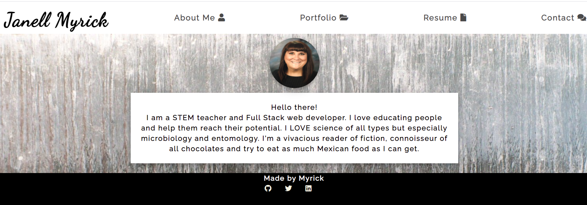

#  My React Portfolio 

   https://luvthatduck.github.io/my-react-portfolio/

## Table of Contents
* [Description](#description)
* [Installation](#installation)
* [Usage](#usage)
* [Licensing](#licensing)
* [Questions](#questions)

## Description 
  An employment-ready portfolio of projects that I built or contributed to, downloadable resume and contact form. 
  
  

## Installation 
  npm install

## Usage
 Built with [Create React App](https://github.com/facebook/create-react-app)

## Licensing

## Questions
For futher questions feel free to contact me:

Github: [luvthatduck](https://github.com/luvthatduck)
Email:  madeby.jmyrick@gmail.com
